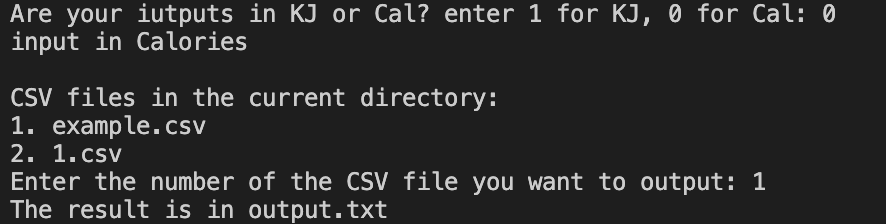

# CS361-sum-all-energy-of-food
This program is to sum up the total of the food energy in either Calorie or Kilojoule and outout the total in both Calorie and Kilojoule.
# csv input file format
one number per row
CSV file example:
```
12
104.5
250
300
```
all data of the file should be in either Calorie or Kilojoule.

# Communication Contract
## how to REQUEST data
1. put the data CSV file into the same directory of the Calculator program
2. run the program
3. input the 1 or 0 for the unit of the data (1 for KJ, 0 for Cal)
4. input the number of the CSV file you want to calculate
### example call


## how to RECEIVE data
1. if REQUEST data success, the result will be print in the output.txt file created by the program
2. output.txt file is locate a the same directory of the Calculator program

## UML sequence diagram


